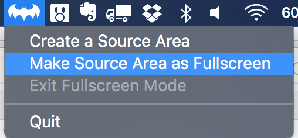

Cyclops a.k.a. project Polyphemus
===

Cyclops is a small utility for Mac that aims to improve the experience when showing something on a secondary screen. Considering how dense is the retina display, selecting a single portion of a that display to be displayed as full screen in a secondary screen, is a reasonable solution.

### Why and when to use it?

A good example is live-coding, most of the time the secondary screen is a projector and the experience of live coding can be annoying due to the huge font and the duplication on a screen that has a low resolution. This is why I prototyped this utility after a nice chat with [@icanzilb](https://github.com/icanzilb).

An example of how it works can be found on [Vimeo](https://vimeo.com/141288676).

### Status

This utility is still in alpha stage, contributions are welcomed and as soon as it's ready to be submitted to the store, I will make it available as free utility.

Current version works only on 10.11 El Capitan, the goal is to have it working on 10.10 Yosemite and higher.

### Contribution

Please feel free to contribute adding features via pull-requests, requesting features or opening issues to report bugs.
